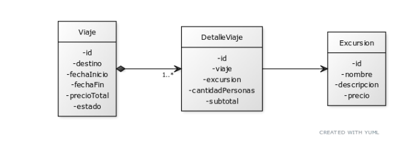

# Parcial I - TEMA B - Sistema de Gestión de Viajes

## Enunciado:

 Una empresa de turismo radicada en la ciudad de Córdoba desea implementar un 
sistema para gestionar los viajes que organiza para sus clientes.
 
 A partir de un primer análisis, se ha determinado que cada viaje tiene un destino, una fecha
 de inicio, una fecha de fin, un precio total y un estado, que puede ser Pendiente, 
Confirmado o Cancelado. Es importante indicar que un viaje en estado Confirmado o 
Cancelado ya no puede cambiar de estado.
 
 A su vez, un viaje está compuesto por uno o más detalles, donde cada detalle representa la
 contratación de una excursión. Las excursiones tienen un nombre, una descripción y un 
precio. En cada detalle de viaje se debe registrar cuántas personas participarán y el 
subtotal correspondiente.

## Modelo de Datos



## Especificaciones Técnicas

- **.NET**: 8.0
- **Runtime**: dotnet 9
- **Base de Datos**: SQL Server
- **ORM**: Entity Framework Core (Data First) o ADO.NET
- **Arquitectura**: Capas (Controller – Service – Repository)
- **Inyección de Dependencias**: Implementada

## Endpoints Requeridos

### 1. Consultar todos los viajes (sin incluir detalles) cuyo precio total supere los $100.000 (30 pts)
```
GET /api/viajes
```


### 2.   Recuperar el primer viaje que posea el estado indicado por parámetros, e incluir en la respuesta todas las excursiones contratadas en el mismo (30 pts)
```
GET /api/viajes/{estado}
```

### 3.  Actualizar la fecha de inicio del viaje, considerando que debe ser anterior a la fecha de fin (40 pts)
```
PUT /api/viajes/{id}/fecha
```

## Implementación

La implementación debe realizarse sobre una API REST en .NET 8, aplicando arquitectura en capas (Controller – Service – Repository), utilizando Entity Framework Core (Data First) o ADO.NET, e implementando inyección de dependencias.


## Condiciones de Entrega

Para la entrega del proyecto deberá realizar commit y push al repositorio destinado a tal fin.

---
**Programación II - 1° Año – 2° Cuatrimestre**